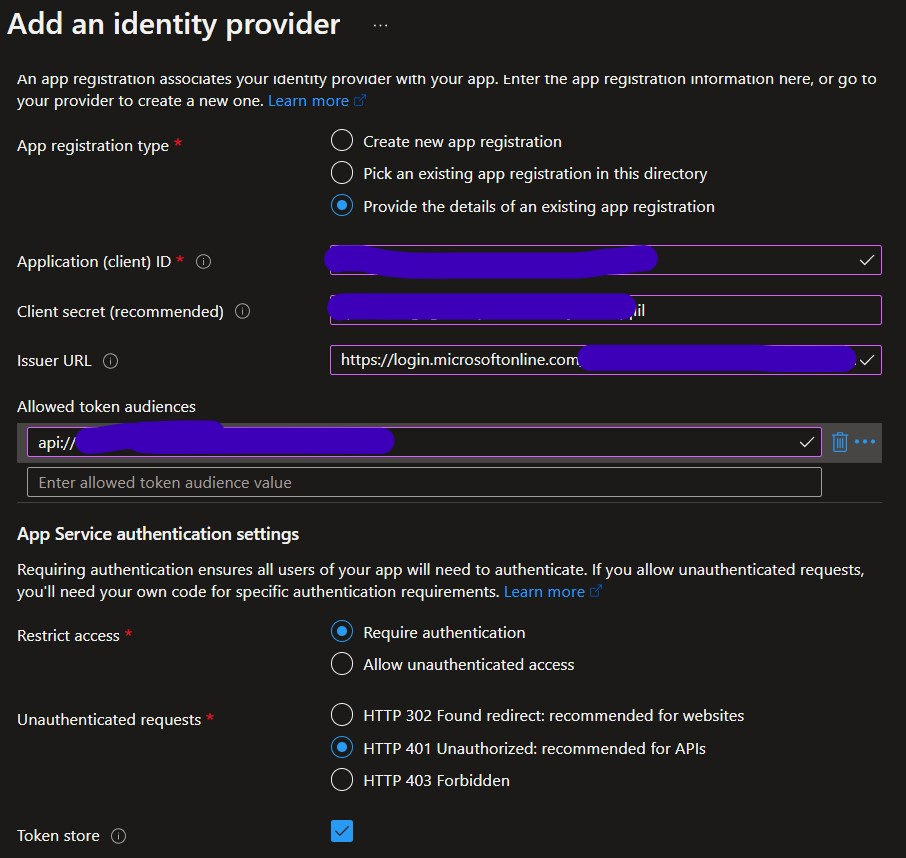
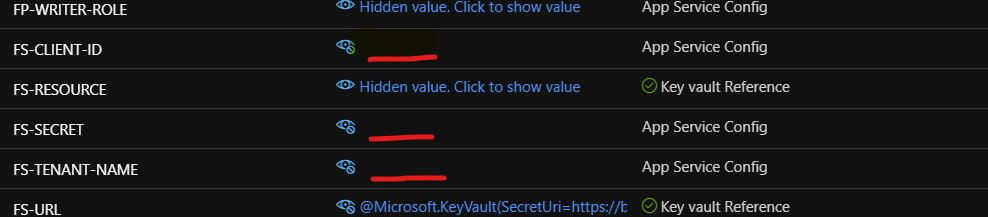

# Notes re the fhir-proxy for learning/upskilling

## Running the Proxy on an AIRS sub 
Based on the security restrictions that comes with our AIRS, I cannot grant admin access to application level permissions that are required to run the fhir-proxy with the fhir-api.

As a workaround, do the following: 
1.  Deploy the fhir-api and fhir-proxy as usual in your AIRS (e.g. [link](https://github.com/microsoft/azure-healthcare-apis-workshop/tree/main/Challenge-01%20-%20Deploy%20Azure%20API%20for%20FHIR%20(PaaS)%2C%20FHIR-Proxy%20(OSS)%2C%20and%20FHIR-Bulk%20Loader%20(OSS)))  
2.  Create the fhir-proxy service principal (SPN) in a secondary AAD tenant (spawned from my AIRS).  **Important:**  Leave the fhir-api's **Authenication** as is, i.e. using [Azure RBAC](https://docs.microsoft.com/en-us/azure/healthcare-apis/azure-api-for-fhir/configure-azure-rbac#confirm-azure-rbac-mode) (and not [Local RBAC](https://docs.microsoft.com/en-us/azure/healthcare-apis/azure-api-for-fhir/configure-local-rbac)).  Make note of the SPN's _tenantId_, _clientId_, _clientSecret_ and the proxy's _Application ID URI_ becasuse it will be used for the proxy function's _Authenication_ aka _Easy Auth_.
3.  Goto the proxy function's _Authenticaton_ blade, add/update a **Microsoft Identity Provider**, select _Provide the details of an existing app registration_ and update with proxy SPN values.  Note: the format for the _issuer URL_ is `https://login.microsoftonline.com/<tenant id>/v2.0`   
    
     
5.  Check that the fhir-proxy's Managed Service Identity (MSI) is enabled and has access to the fhir-api as a "Fhir Data Contributor" RBAC role within its IAM blade in the portal.
6.  Modified the fhir-proxy "Configuration" aka _app settings_ to ensure the authenication between the proxy and the api is using its MSI.  Make sure _FS-RESOURCE_ is using the correct fhir reource, e.g. `https://<fhir-api-url>..azurehealthcareapis.com` and the _FS-CLIENT-ID_, _FS-SECRET_ and _FS-TENANT-NAME_ are empty - **this combination will force the fhir-proxy to use its MSI to authenicate with the fhir-api**.

     
6.  [Create a service/postman client SPN in the secondary tenant](https://github.com/microsoft/health-architectures/tree/main/Postman#step-1---create-an-app-registration-for-postman-in-aad).
7.  Use Postman as usual against the [fhir-proxy postman environment](https://github.com/microsoft/health-architectures/tree/main/Postman#step-3---import-environment-and-collection-files-into-postman) to verify.

Note:
With this setup, to call the fhir-api directly (not through the proxy) requires another SPN to be set up on the same tenant where the fhir-api resides and not on the secondary tenant.  This SPN will need only a single API Permission, _Azure Healthcare APIs - user_impersonation_ which does not require admin consent along with being assigned the _FHIR Data Contributor_ RBAC role to the fhir-api.  
